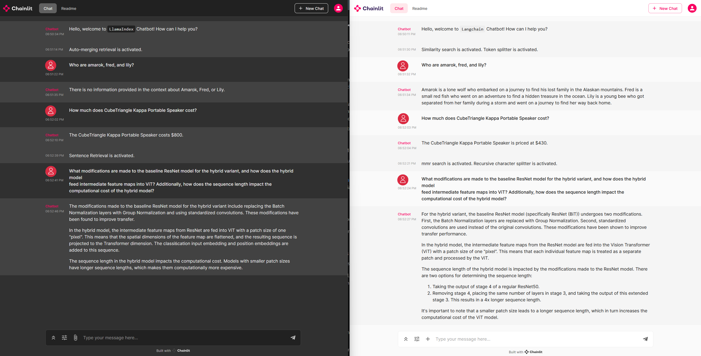

# RAG-Tech: LangChain vs LlamaIndex

**RAG-Tech** is a project that systematically compares the performance of five well-known Retrieval-Augmented Generation (RAG) techniques implemented using the LangChain and LlamaIndex frameworks. The evaluation is conducted on a dataset consisting of 40 questions across five different documents. Additionally, the project provides two separate RAG chatbots, offering eight distinct RAG techniques from these frameworks.

## RAG Techniques Evaluated

1. **LangChain** with `RecursiveCharacterTextSplitter` (chunk_size: 1500, chunk_overlap: 500) and `search_type=similarity`.
2. **LangChain** with `RecursiveCharacterTextSplitter` (chunk_size: 1500, chunk_overlap: 500) and `search_type=mmr`.
3. **LangChain** with `TokenTextSplitter` (chunk_size: 1500, chunk_overlap: 500) and `search_type=mmr`.
4. **LlamaIndex** with `sentence_retrieval` (sentence_window_size: 3, similarity_top_k: 6, rerank_top_n: 2).
5. **LlamaIndex** with `auto_merging_retrieval` (chunk_sizes: [2048, 512, 128], similarity_top_k: 6, rerank_top_n: 2).
6. **LlamaIndex** with `basic RAG`.

## Documents Used for Testing

1. **stories.pdf** – Contains three short stories (5 questions).
2. **Product specifications.pdf** – Features 30 fictional product names and descriptions (5 questions).
3. **technical support.pdf** – Includes 20 Q&A pairs simulating a technical support scenario (5 questions).
4. **VisionTransformer.pdf** – A single-column scientific paper (11 questions).
5. **SegmentAnything.pdf** – A two-column scientific paper (14 questions).

## Environment Setup

LangChain and LlamaIndex require different dependencies that are incompatible within the same environment. To facilitate a fair comparison, both frameworks are included in the same project directory but must be executed in separate Python environments.

### Setting up the LlamaIndex environment:

1. Create a new environment.
2. Install dependencies:

   ```
   pip install -r llama_index_env_requirements.txt
   ```

### Setting up the LangChain environment:

1. Create a new environment.
2. Install dependencies:

   ```
   pip install -r langchain_env_requirements.txt
   ```

## Preparing Vector Databases

From the project root directory:

1. Activate the **LlamaIndex** environment and run:

   ```
   python src/llama_index/prepare_indexes.py
   ```

   This will create the following indexes in `data/indexes`:
   - `basic_index`
   - `merging_index`
   - `pagewise_index`
   - `sentence_index`

2. Activate the **LangChain** environment and run:

   ```
   python src/langchain/prepare_vectordb.py
   ```

   This will generate:
   - `langchain_index` in `data/indexes`

## Testing the RAG Chatbots

### Using the LlamaIndex chatbot:

1. Activate the LlamaIndex environment.
2. Run:

   ```
   chainlit run src/llama_index/chatbot.py
   ```

   The chatbot will launch on **port 8000** in the browser. Users can select from four RAG techniques:
   - Page-wise RAG
   - Basic RAG
   - Sentence Retrieval
   - Auto-Merging Retrieval

### Using the LangChain chatbot:

1. Activate the LangChain environment.
2. Run:

   ```
   chainlit run src/langchain/chatbot.py --port=8585
   ```

   The chatbot will be available on **port 8585**, allowing users to switch between different retrieval techniques.

*Both chatbots can run simultaneously on separate ports.*

## Running the Evaluation Pipeline

### Prerequisites

- The vector indexes must be created in the `data` folder.
- An evaluation dataset (`eval_ds.xlsx`) must be placed in `data/eval_questions/`. A sample file is provided for reference.

### Running the Evaluation

#### Evaluating LlamaIndex Techniques:

1. Activate the LlamaIndex environment.
2. Run the evaluation for each technique:

   ```
   set llama_eval_method="auto_merging_retrieval"
   python src/evaluate_rag_techniques/run_llama_index.py
   ```

   ```
   set llama_eval_method="sentence_retrieval"
   python src/evaluate_rag_techniques/run_llama_index.py
   ```

   Results are stored in `llama_index_sentence_retrieval_result` and `llama_index_auto_merging_retrieval_result` columns in the Excel file.

#### Evaluating LangChain Techniques:

1. Activate the LangChain environment.
2. Run the evaluation for each combination of retrieval settings:

   ```
   set search_type="similarity"
   set splitter_type="recursive"
   python src/evaluate_rag_techniques/run_langchain.py
   ```

   ```
   set search_type="mmr"
   set splitter_type="token"
   python src/evaluate_rag_techniques/run_langchain.py
   ```

   Results are stored in `langchain_similarity_result` and `langchain_mmr_result` columns in the Excel file.

### Scoring the Models with GPT

1. Run the evaluation for each RAG technique:

   ```
   python src/evaluate_rag_techniques/run_gpt_eval.py
   ```

   This collects model performance scores and inference times.

## Observing Performance

To analyze the final results, open and review `src/check_final_results.ipynb`.

## Complete Workflow in One Command Sequence

```
pip install -r llama_index_env_requirements.txt
pip install -r langchain_env_requirements.txt
python src/llama_index/prepare_indexes.py
python src/langchain/prepare_vectordb.py
chainlit run src/llama_index/chatbot.py
chainlit run src/langchain/chatbot.py --port=8585
python src/evaluate_rag_techniques/run_llama_index.py
python src/evaluate_rag_techniques/run_langchain.py
python src/evaluate_rag_techniques/run_gpt_eval.py
```

## RAG Chatbots: LlamaIndex vs LangChain

<div align="center">
  
</div>
